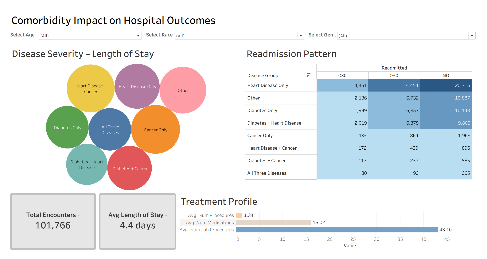
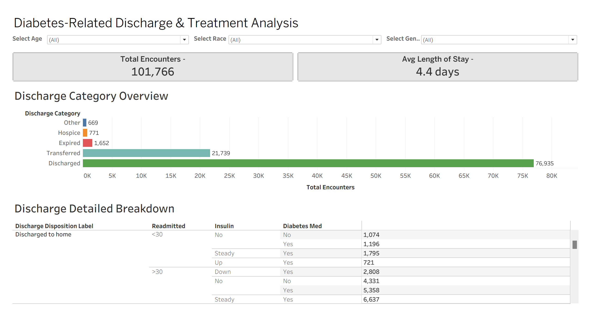

# 📊 Healthcare Comorbidity & Patient Outcome Analysis

Interactive **Tableau dashboards** analyzing hospital outcomes and comorbidity patterns using the **Diabetes 130-US Hospitals dataset**.

**[🚀 View Live Dashboard](https://public.tableau.com/views/Healthcare_Comorbidity_Patient_Outcome_Analysis/ComorbidityImpactonHospitalOutcomes)**

---

# 📑 Table of Contents

1. Project Overview  
2. Dataset  
3. Data Cleaning & Preparation  
4. Disease Grouping Strategy  
5. Dashboards  
6. Key Insights  
7. Tools Used  
8. Project Structure  
9. References  

---

# 📊 Project Overview

Healthcare institutions generate vast amounts of patient data, but identifying patterns that influence hospital outcomes can be difficult without effective visualization.

This project analyzes **hospital patient outcomes and disease comorbidity patterns** using the **Diabetes 130-US Hospitals dataset**.

The analysis focuses on understanding how combinations of diseases such as:

• Diabetes  
• Heart Disease  
• Cancer  

affect:

• Hospital length of stay  
• Readmission patterns  
• Treatment intensity  
• Discharge outcomes  

Interactive dashboards were created using **Tableau** to explore these relationships and present insights through intuitive visualizations.

---

# 🗂 Dataset

**Dataset Used**

Diabetes 130-US Hospitals Dataset

**Sources**

• UCI Machine Learning Repository  
https://archive.ics.uci.edu/ml/datasets/Diabetes+130-US+hospitals+for+years+1999-2008  

• Kaggle Dataset  
https://www.kaggle.com/datasets/brandao/diabetes  

The dataset contains hospital encounter records including:

• Patient demographics  
• Diagnoses  
• Treatment information  
• Medication usage  
• Hospital stay duration  
• Readmission status  

Total records analyzed:

**101,766 patient encounters**

---

# 🧹 Data Cleaning & Preparation

The raw dataset required several preprocessing steps before it could be used for visualization.

The following data preparation tasks were performed.

### Data Cleaning

• Removed unnecessary and irrelevant columns  
• Handled missing and inconsistent values  
• Standardized categorical variables  
• Simplified discharge disposition categories  
• Cleaned dataset structure for easier analysis  

### Dataset Simplification

Only relevant columns required for analysis were kept, including:

encounter_id  
patient_nbr  
age  
gender  
race  
disease_type  
time_in_hospital  
readmitted  
num_medications  
insulin  
diabetesMed  
discharge_disposition_label  

This produced a **clean dataset optimized for dashboard visualization and analysis**.

---

# 🧬 Disease Grouping Strategy

A new variable **disease_type** was created to identify disease combinations.

The grouping was derived from diagnosis columns:

diag_1  
diag_2  
diag_3  

Based on these diagnosis codes, patients were categorized into the following groups:

Diabetes Only  
Heart Disease Only  
Cancer Only  
Diabetes + Heart Disease  
Diabetes + Cancer  
Heart Disease + Cancer  
All Three Diseases  
Other  

This grouping enabled analysis of **comorbidity patterns and their impact on hospital outcomes**.

---

# 📊 Dashboards

Two interactive dashboards were developed using Tableau.

---

## Dashboard 1  
### Comorbidity Impact on Hospital Outcomes

This dashboard provides an overview of how disease combinations influence hospital outcomes.

Key components include:

• Disease severity vs hospital stay visualization  
• Readmission patterns across disease groups  
• Treatment intensity indicators  
• KPI for total patient encounters  
• KPI for average hospital stay  

This dashboard highlights how different comorbidity patterns affect hospital outcomes.

---

## Dashboard 2  
### Diabetes-Related Discharge & Treatment Analysis

This dashboard focuses specifically on diabetes-related hospital outcomes.

Key visualizations include:

• Discharge category distribution  
• Detailed discharge breakdown  
• Insulin treatment patterns  
• Diabetes medication usage  
• Readmission patterns among diabetes patients  

This dashboard enables deeper exploration of treatment patterns and discharge outcomes.

---

# 🔎 Key Insights

Several insights emerge from the analysis:

• Patients with **multiple comorbidities tend to have longer hospital stays**.

• **Readmission patterns vary across disease combinations**.

• Diabetes treatment intensity is associated with differences in discharge outcomes.

• A majority of patients are **discharged home**, while smaller portions are transferred or admitted to hospice care.

---

# 🛠 Tools Used

• Tableau Public  
• Data Cleaning  
• Data Visualization  
• Healthcare Data Analysis  

---

# 📁 Project Structure

Healthcare-Comorbidity-Patient-Outcome-Analysis

│  
├── dashboards  
│   └── Healthcare_Comorbidity_Patient_Outcome_Analysis.twbx  

│  
├── dataset  
│   └── hospital_outcome_cleaned.csv  

│  
├── images  
│   ├── dashboard1.png  
│   └── dashboard2.png  

│  
├── docs  
│   └── project_report.md  

│  
└── README.md  

---

# 📊 Live Dashboard

Explore the interactive Tableau dashboards here:

https://public.tableau.com/views/Healthcare_Comorbidity_Patient_Outcome_Analysis/ComorbidityImpactonHospitalOutcomes

---

# 📚 References

• UCI Machine Learning Repository – Diabetes 130-US Hospitals Dataset  
https://archive.ics.uci.edu/ml/datasets/Diabetes+130-US+hospitals+for+years+1999-2008  

• Kaggle Dataset Source  
https://www.kaggle.com/datasets/brandao/diabetes  

---

[⬆️ Back to top](#readme-top)

